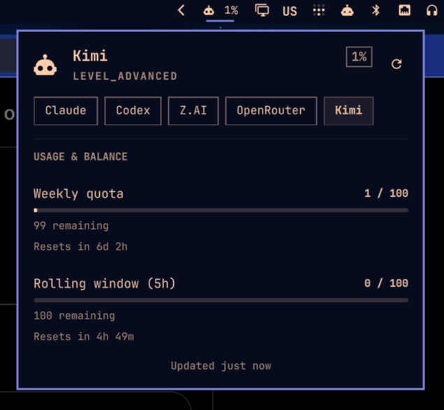

# ai-usagebar

Native Omarchy Quattro panel, Waybar widget, and tabbed TUI for AI plan usage across **Claude**, **Codex/ChatGPT**, **Z.AI (GLM)**, **OpenRouter**, **DeepSeek**, **Kimi**, and other supported AI coding services.

This started as a Rust port of [`claudebar`](https://github.com/mryll/claudebar) and stays drop-in compatible with it. It keeps the minimalist Pango-bordered tooltip, Omarchy theme auto-detection, and flock-protected OAuth refresh, then adds broad multi-vendor support and a proper testable codebase instead of one long shell script.



## Features

- **Per-vendor Waybar modules** with the same JSON shape as claudebar.
- **Native Omarchy Quattro plugin** with the shell's own theme tokens, popup
  geometry, controls, keyboard navigation, provider switching, live reset
  countdowns, and cache/error states. The repository installs directly through
  `omarchy plugin add` on Omarchy 4.
- **Tabbed TUI** (`ai-usagebar-tui`) with Tab/h/l switching, per-tab refresh, and 60-second auto-refresh. Native ratatui widgets fill the available terminal width and keep the vendor tabs visually consistent. Opens on an **Overview** tab summarizing every vendor at once (one compact row each); `[ui] overview_vendors` picks which vendors it lists, while `[ui] vendor_box = "sidebar" | "navbar" | "none"` controls the navigation layout.
- **Optional local Claude Code context monitor** in the TUI, with a bounded,
  compaction-aware view of recent session input-context usage.
- **Native desktop integrations** for Omarchy Quattro, GNOME Shell, and the
  macOS menu bar. Omarchy consumes the complete multi-provider report; the
  macOS app supports thirteen vendors and the GNOME extension covers
  Claude, Codex, Z.AI, OpenRouter, DeepSeek, and Google Antigravity.
- **Scroll-to-cycle on the bar**: wire `on-scroll-up` / `on-scroll-down`, and one bar item cycles through your enabled vendors.
- **Config-driven primary vendor**: set `[ui] primary` once; the widget shows that vendor by default and the TUI opens on its tab.
- **Local testing tools**: `--pretty` renders ANSI-colored terminal output (auto-detects TTY), and `--watch N` re-renders every N seconds.
- **Drop-in claudebar compatibility** with the same flags (`--icon`, `--format`, `--tooltip-format`, `--pace-tolerance`, `--format-pace-color`, `--tooltip-pace-pts`, `--color-*`) and `{placeholders}`.
- **Always exits 0**, because Waybar hides modules that don't.
- **Atomic cache writes + flock**, so multi-monitor Waybar instances can coexist without API stampedes.
- **Separate transient and hard errors**: DNS/timeout failures show a quiet `Loading…`; HTTP 4xx/5xx errors put the code in the tooltip.
- **Live API smoke tests**: `make smoke` hits the real undocumented endpoints and catches schema drift early.

## Install

### Omarchy Quattro

The native plugin is a display frontend and does not bundle the
`ai-usagebar` executable. Install the binary first, then add and enable the
plugin:

```bash
omarchy pkg aur add ai-usagebar-bin
omarchy plugin add https://github.com/akitaonrails/ai-usagebar.git --enable
```

Quattro enables its own `omarchy.agents` status widget by default. Disable it
if you want AI Usage to be the only agent status item in the bar:

```bash
omarchy plugin disable omarchy.agents
```

The source-built `ai-usagebar` AUR package can replace `ai-usagebar-bin` in
the first command.

### Arch (AUR)

Two packages. Pick one:

```bash
yay -S ai-usagebar-bin    # prebuilt binary from GitHub Releases (fast, ~5s install)
yay -S ai-usagebar        # compiles from source (~30-60s, hermetic)
```

The `-bin` variant downloads the same x86_64 ELF that CI built and tested. The source variant compiles locally with your toolchain. Both install identical binaries to `/usr/bin/`. If you already have one installed, switch with `yay -S` the other package; pacman handles the swap through `conflicts`/`provides`.

### Other Linux / macOS (crates.io)

```bash
cargo install ai-usagebar                # compile from source (needs rustup)
cargo binstall ai-usagebar               # download prebuilt binary (needs cargo-binstall, no rustup)
```

`cargo binstall` fetches the same x86_64 / aarch64 Linux tarball the AUR `-bin` package uses. Both install `ai-usagebar` + `ai-usagebar-tui` to `~/.cargo/bin/`.

### From source

```bash
cargo build --release
sudo make install                  # → /usr/local/bin
# or
make install PREFIX=$HOME/.local   # → ~/.local/bin
```

### Windows

The **Waybar widget is Wayland-only and does not apply to Windows.** The
**`ai-usagebar-tui`** binary, however, runs natively, and `ai-usagebar --json`
/ `--pretty` work too (handy for feeding a custom tray/widget). Build with a
standard Rust toolchain:

```powershell
cargo build --release
# binaries land in target\release\ai-usagebar.exe and ai-usagebar-tui.exe
```

Credentials are read from the Windows user profile rather than `$HOME`:
`%USERPROFILE%\.claude\.credentials.json` (Anthropic) and
`%USERPROFILE%\.codex\auth.json` (OpenAI Codex). Run the official `claude` /
`codex` CLI once on Windows to populate them, exactly as on Linux/macOS.
API-key vendors work unchanged via environment variables or `config.toml`.

## Authentication

Each vendor authenticates a little differently. Claude and Codex use OAuth credentials that their official CLIs already wrote to disk, several vendors use API keys, and local-product integrations reuse their own signed-in session or local server. The table below is authoritative; API keys can come from environment variables or, if you do not source secrets in your shell, inline `config.toml` values.

| Vendor | Method | Action required |
|---|---|---|
| Claude | OAuth, read from `~/.claude/.credentials.json` (or the macOS login Keychain — see below) | Run `claude` once to log in. Token auto-refreshes. |
| Anthropic API | Console Admin key (`ANTHROPIC_ADMIN_KEY` env or `[anthropic_api] api_key` in config) | Set either. Opt-in. This is an organization Admin key (`sk-ant-admin01-…`), not an inference key or Claude Code OAuth credential. |
| Codex | OAuth, read from `~/.codex/auth.json` | Run `codex login` once. Token auto-refreshes. |
| Z.AI | API key (`ZAI_API_KEY` env or `[zai] api_key` in config) | Set either. |
| OpenRouter | API key (`OPENROUTER_API_KEY` env or `[openrouter] api_key` in config) | Set either. |
| DeepSeek | API key (`DEEPSEEK_API_KEY` env or `[deepseek] api_key` in config) | Set either. Opt-in — see below. |
| Kimi | API key (`KIMI_API_KEY` env or `[kimi] api_key` in config) | Set either. Opt-in — see below. |
| Kilo | API key (`KILO_API_KEY` env or `[kilo] api_key` in config) | Set either. Opt-in. For a team balance, also set `[kilo] organization_id`; omit it for the personal balance. |
| Novita | API key (`NOVITA_API_KEY` env or `[novita] api_key` in config) | Set either. Opt-in. |
| Moonshot | API key (`MOONSHOT_API_KEY` env or `[moonshot] api_key` in config) | Set either. Opt-in. Set `[moonshot] region = "cn"` for `api.moonshot.cn` (balance in CNY); the default `"global"` uses `api.moonshot.ai` (USD). |
| Grok (xAI) | **Management** key (`XAI_MANAGEMENT_KEY` env or `[grok] api_key` in config) | Set either. Opt-in. This is **not** the inference key — create it under xAI Console → Management keys. See the team note below. |
| SuperGrok | None — official Grok Build `x.ai/billing` ACP extension | Opt-in. Install the official Grok Build CLI and run `grok login` once. Grok Build retains sole ownership of tokens, account scope, custom OIDC/external providers, proxies, and refresh locking. Reports the current weekly or monthly included-credit period — **not** the Management API prepaid balance. |
| MiniMax | **Token Plan** key (`MINIMAX_API_KEY` env or `[minimax] api_key` in config) | Set either. Opt-in. Must be the Token Plan **subscription** key — a pay-as-you-go key has no plan quota to report. Set `[minimax] region = "cn"` for `api.minimaxi.com`; the default `"global"` uses `api.minimax.io`. The two are separate instances and reject each other's keys. |
| Google Antigravity | None — read from the local Antigravity server | Opt-in. Quota is served only while Antigravity 2.0, the Antigravity IDE, or an interactive `agy` session is running; all three share one account-wide quota. |
| Cursor | None — read from Cursor's local `state.vscdb` (or the `cursor-agent` CLI's `auth.json`) | Opt-in. Sign in to the Cursor IDE at least once; ai-usagebar reads the session token it already wrote there. No key of your own to create. Headless machines with no desktop IDE work too: sign in to `cursor-agent` once and its own `auth.json` is used as a fallback when the IDE database is absent. |
| Kiro CLI | None — read from kiro-cli's local `data.sqlite3` | Opt-in. Run `kiro-cli login` at least once; ai-usagebar reads the AWS SSO OIDC session it already wrote there and refreshes it itself when close to expiry. No key of your own to create. |

#### Grok: team-scoped vs organization-scoped keys

The balance lives at `/v1/billing/teams/{team}/prepaid/balance`, so a team has to
be identified. With a **team-scoped** management key the team is read
automatically from the key. With an **organization-scoped** key it cannot be —
that key's `scopeId` is an *organization* id, not a team — so set the team
explicitly:

```toml
[grok]
team_id = "your-team-id"
```

Without it, an organization-scoped key reports an error saying exactly this
rather than silently querying the wrong URL.

### Enabling a vendor

`enabled = true` is what makes a vendor fetch. Anthropic API, DeepSeek, Kimi,
Kilo, Novita, Moonshot, Grok, SuperGrok, Antigravity, Cursor, MiniMax, and Kiro CLI all default to **disabled** so that existing
installs are unaffected until you opt in. Two ways to do it:

- **Via Settings**: use the gear or `s` in the Omarchy panel, or run
  `ai-usagebar-tui` and press `s`. Saving a non-empty API key sets that vendor's
  `enabled = true` for you. Clearing it removes the inline key from
  `config.toml`.
- **By hand**: add `enabled = true` to the vendor's section alongside the key.

The primary-vendor selector only offers vendors that are currently enabled, so a
vendor you haven't opted into cannot be set as primary.

### Credential resolution order (for API-key vendors)

For each API-key vendor, ai-usagebar checks in this order:

1. **Env var named by `api_key_env`** in config (defaults: `ANTHROPIC_ADMIN_KEY`, `ZAI_API_KEY`, `OPENROUTER_API_KEY`, `DEEPSEEK_API_KEY`, `KIMI_API_KEY`, `KILO_API_KEY`, `NOVITA_API_KEY`, `MOONSHOT_API_KEY`, `XAI_MANAGEMENT_KEY`). If set + non-empty, used.
2. **Inline `api_key`** in the same config section.
3. Otherwise, **error** with a message naming both options.

### Security

- If you put inline `api_key` values in config, `chmod 600 ~/.config/ai-usagebar/config.toml`. The default behavior reads only env vars, which is safer when your config might be world-readable.
- Don't commit your config dir if you check it into dotfiles unless you've redacted `api_key` lines.
- OAuth credential files (`~/.claude/.credentials.json`, `~/.codex/auth.json`) are managed by their respective CLIs and already chmod-protected. SuperGrok is stricter: ai-usagebar never parses or writes Grok credentials; it asks the official Grok Build process for a credential-free billing result. The auth/config files are only hashed as opaque bytes to prevent cross-login cache reuse.
- Cursor's session token lives in its own `state.vscdb`, managed entirely by the Cursor IDE — ai-usagebar opens it read-only and never writes to it. On machines without the IDE, the `cursor-agent` CLI's own `auth.json` is read as a fallback instead — same read-only treatment.
- kiro-cli's AWS SSO OIDC session lives in its own `data.sqlite3`, managed entirely by kiro-cli — ai-usagebar opens it read-only; refreshed credentials are stored atomically in an account-scoped `kiro/oauth.json` cache file (mode 0600 on Unix), never written back to kiro-cli's database.

#### macOS: Anthropic credentials in the Keychain

On macOS, recent Claude Code builds don't write `~/.claude/.credentials.json` — they keep the same OAuth JSON in the **login Keychain** under the generic-password service `Claude Code-credentials`. ai-usagebar detects the missing file and transparently reads (and writes refreshed tokens back to) that Keychain item via the built-in `security` tool, so no manual step is needed. Scoped `CLAUDE_CONFIG_DIR` logins use their own `Claude Code-credentials-<hash>` item, which lets named accounts remain isolated. The default account still prefers an existing credentials file; named accounts prefer their scoped Keychain item and fall back to the file on Linux.

## Configuration

`~/.config/ai-usagebar/config.toml` (optional — defaults enable Claude, Codex, Z.AI, and OpenRouter; all other vendors are opt-in). Full example:

```toml
[ui]
# Which vendor the widget shows when --vendor is omitted, AND which tab
# is selected when the TUI opens. Defaults to anthropic when not set.
# Only a vendor that is enabled can be primary.
# primary = "anthropic"   # anthropic | anthropic_api | openai | zai
#                         # | openrouter | deepseek | kimi | kilo | novita
#                         # | moonshot | grok | supergrok | antigravity | cursor
#                         # | minimax | kiro

[context]
enabled = false           # opt in, then press c in ai-usagebar-tui
# projects_path = "~/.claude/projects"
# context_window_tokens = 200000  # optional fallback denominator
# [context.model_context_window_tokens]
# "claude-opus-4-6" = 1000000    # exact model id overrides the fallback

[anthropic]
enabled = true
# credentials_path = "/home/you/.claude/.credentials.json"

[anthropic_api]
enabled = true             # disabled by default; requires an organization Admin key
api_key_env = "ANTHROPIC_ADMIN_KEY"
# api_key = "sk-ant-admin01-..."  # not an inference key; chmod 600 if inline
# monthly_limit = 1000     # optional positive, finite USD display limit

[openai]
enabled = true
# codex_auth_path = "/home/you/.codex/auth.json"

[zai]
enabled = true
api_key_env = "ZAI_API_KEY"
# api_key = "..."          # used if ZAI_API_KEY is unset; chmod 600 the file!
# plan_tier = "lite"       # lite | pro | max — display-only

[openrouter]
enabled = true
api_key_env = "OPENROUTER_API_KEY"
# api_key = "sk-or-v1-..."

[deepseek]
enabled = true             # disabled by default; enable once you add an API key
api_key_env = "DEEPSEEK_API_KEY"
# api_key = "sk-..."       # used if DEEPSEEK_API_KEY is unset; chmod 600 the file!

[kimi]
enabled = true             # disabled by default; enable once you add an API key
api_key_env = "KIMI_API_KEY"
# api_key = "sk-..."       # used if KIMI_API_KEY is unset; chmod 600 the file!

[minimax]
enabled = true             # disabled by default; enable once you add an API key
api_key_env = "MINIMAX_API_KEY"
# api_key = "..."          # used if MINIMAX_API_KEY is unset; chmod 600 the file!
# region = "global"        # global -> api.minimax.io | cn -> api.minimaxi.com

# --- Account-balance vendors (all opt-in) ---

[kilo]
enabled = true             # disabled by default; enable once you add an API key
api_key_env = "KILO_API_KEY"
# api_key = "..."          # used if KILO_API_KEY is unset; chmod 600 the file!
# organization_id = "org_..."   # team balance; omit for the personal balance

[novita]
enabled = true             # disabled by default; enable once you add an API key
api_key_env = "NOVITA_API_KEY"
# api_key = "..."          # used if NOVITA_API_KEY is unset; chmod 600 the file!

[moonshot]
enabled = true             # disabled by default; enable once you add an API key
api_key_env = "MOONSHOT_API_KEY"
# api_key = "sk-..."       # used if MOONSHOT_API_KEY is unset; chmod 600 the file!
# region = "global"        # global → api.moonshot.ai (USD) | cn → api.moonshot.cn (CNY)

[grok]
enabled = true             # disabled by default; enable once you add an API key
# The xAI *Management* key, NOT the inference key.
api_key_env = "XAI_MANAGEMENT_KEY"
# api_key = "..."          # used if XAI_MANAGEMENT_KEY is unset; chmod 600 the file!
# Required for organization-scoped keys; auto-resolved for team-scoped ones.
# team_id = "..."

[supergrok]
enabled = true             # disabled by default; enable once you've run `grok login`
# No API key: billing comes from the official Grok Build ACP process.
# Defaults to $GROK_HOME/bin/grok or ~/.grok/bin/grok. Override only when the
# trusted official binary was installed elsewhere.
# grok_binary = "/opt/grok/bin/grok"
# Opaque cache-scope fingerprint inputs; neither file is parsed or copied.
# auth_path = "/home/you/.grok/auth.json"
# config_path = "/home/you/.grok/config.toml"

[cursor]
enabled = true             # disabled by default; enable once you've signed in to Cursor
# No API key: reads the session token the Cursor IDE already wrote to its own
# state.vscdb after you signed in there. No desktop IDE (headless machine)?
# Sign in to the cursor-agent CLI once instead — its own auth.json is the
# fallback when the IDE database is absent.
# db_path = "/home/you/.config/Cursor/User/globalStorage/state.vscdb"
# agent_auth_path = "/home/you/.config/cursor/auth.json"

[kiro]
enabled = true             # disabled by default; enable once you've run `kiro-cli login`
# No API key: reads the AWS SSO OIDC session kiro-cli already wrote to its own
# data.sqlite3 after you logged in there.
# db_path = "/home/you/.local/share/kiro-cli/data.sqlite3"
```

## Quick start

```bash
# Local testing — auto-detects TTY and renders human-readable output.
ai-usagebar                        # uses [ui] primary (defaults to anthropic)
ai-usagebar --vendor anthropic_api
ai-usagebar --vendor openai
ai-usagebar --vendor zai
ai-usagebar --vendor openrouter
ai-usagebar --vendor deepseek
ai-usagebar --vendor kimi
ai-usagebar --vendor kiro

# Force Waybar JSON (e.g. piping into jq).
ai-usagebar --json

# Everything at once: quota + time-to-reset for every configured vendor,
# with one entry per named Claude account.
ai-usagebar usage
ai-usagebar usage --json | jq '.entries[] | {id, metrics, sections}'

# Live preview while iterating on --format / --tooltip-format.
ai-usagebar --vendor openrouter --watch 5

# Interactive TUI with tabs.
ai-usagebar-tui
```

In JSON, `metrics` contains only percentage gauges. The ordered `sections`
array is the lossless view and also includes balance text, grouped breakdowns,
and visual spacers; non-percentage rows never invent a numeric percentage.
The report also exposes the configured `primary` id. Entries carry a canonical
`display_name` plus `status`, `stale`, and `fetched_at`; metric rows carry
`severity` and the absolute `reset_at` timestamp when the provider reports one.
These fields are additive, so existing report consumers remain compatible.

## Standalone TUI — no Waybar required

The two binaries are independent. If you don't run Waybar (or just want to check usage occasionally rather than have it on your bar permanently), `ai-usagebar-tui` works as a fully standalone terminal app:

```bash
ai-usagebar-tui                    # opens in your current terminal
```

It runs in any terminal emulator (Kitty, Alacritty, Foot, Ghostty, etc.), works in plain SSH sessions, and doesn't need a compositor or window manager integration. All controls and the Settings overlay work the same way. Use it as:

- An ad-hoc check ("am I close to my Claude weekly limit before I start a long session?")
- A foreground monitor on a secondary screen or tmux pane while you code
- A shell-only tool on remote machines (just install the binary; no Waybar/Hyprland dependencies)

The Waybar widget is optional. The TUI is the best way to see every enabled vendor at once, even if you never set up the widget.

## Native desktop integrations

### Omarchy Quattro

Omarchy 4's Quattro shell can host ai-usagebar as a native Quickshell plugin.
Follow the two-step [Omarchy installation](#omarchy-quattro) above; adding the
plugin alone does not install its binary dependency.

Update or remove the plugin without editing `shell.json` by hand:

```bash
omarchy plugin update akitaonrails.ai-usagebar
omarchy plugin remove akitaonrails.ai-usagebar
```

The widget uses the providers and accounts already enabled in
`~/.config/ai-usagebar/config.toml`; it never stores a second copy of API keys.
Left-click opens the panel, right-click launches the TUI, and middle-click or
scroll switches providers. Open the gear or press `s` for the native QML
settings form. See the [Omarchy plugin guide](omarchy/README.md) for its
drop-in compatibility and credential-handling details, keyboard controls,
update commands, and development checks.

The only plugin dependency is the `ai-usagebar` executable installed above.
Inside Quattro's unsandboxed shell process, the plugin runs the fixed
`ai-usagebar usage --json` command for reports and launches `ai-usagebar-tui`
only when requested. It installs no service, runs no installer of its own,
requests no elevated privileges, and does not overwrite user configuration.

### GNOME and macOS

The [macOS menu bar app](macos/README.md) supports thirteen vendors — **Claude, Codex, Z.AI, OpenRouter, DeepSeek, Kimi, Kilo, Novita, Moonshot, Grok (xAI), Anthropic API, Cursor, and Google Antigravity**. The [GNOME Shell extension](gnome-extension/README.md) supports **Claude, Codex, Z.AI, OpenRouter, DeepSeek, and Google Antigravity**, whose two independent quota pools it renders as grouped rows. Cursor is not in the GNOME extension yet — use `ai-usagebar --vendor cursor` or the TUI there.

## Waybar config

### Single module, scroll-to-cycle (recommended)

Use one bar item and scroll through your vendors. The TUI on-click still shows them all:

```jsonc
"modules-right": ["custom/aibar", ...],

"custom/aibar": {
    "exec": "ai-usagebar --format '{vendor_short} {session_pct}% · {session_reset}'",
    "return-type": "json",
    "interval": 300,
    "signal": 13,
    "tooltip": true,
    "on-click": "ai-usagebar-tui",
    "on-scroll-up":   "ai-usagebar --cycle-next",
    "on-scroll-down": "ai-usagebar --cycle-prev"
}
```

The `{vendor_short}` placeholder always expands to a 3-letter vendor ID (`cld` / `gpt` / `zai` / `opr` / `dsk` / `kmi` / `klo` / `nvt` / `msh` / `grk` / `sgk` / `aac` / `agy` / `cur` / `mmx` / `kir`), so the bar text tells you which vendor is active. The other usage placeholders (`{session_pct}` for Anthropic, `{oai_session_pct}` for OpenAI, etc.) are vendor-specific. If you want one format string for every cycled vendor, prefer the generic aliases: `{session_pct}`, `{session_reset}`, `{weekly_pct}`, and `{weekly_reset}` are implemented by all eleven usage vendors (Anthropic, OpenAI, Z.AI, OpenRouter, DeepSeek, Kimi, Antigravity, Cursor, MiniMax, Kiro CLI, and SuperGrok; OpenRouter and DeepSeek use `0` / `—` for the windows they don't expose). Cursor has no time windows but two usage *pools*, so it maps them onto the two generic slots: `session_pct` = **Cursor Models** (Auto + Composer), `weekly_pct` = **Other Models** (named / API), both resetting on the billing cycle. Kiro CLI has a single pool, so both generic slots map to `kiro_pct`. Anthropic and OpenAI add `*_elapsed`, `*_pace`, and `*_bar` families; Antigravity adds `*_elapsed` for all four of its windows, plus `{session_model}` / `{weekly_model}` / `{scoped_model}` / `{extra_model}`, which name the model group each row belongs to (vendors with a single quota pool leave them empty). The established API-backed vendors also expose their own `{oai_*}` / `{zai_*}` / `{or_*}` / `{ds_*}` / `{kimi_*}` / `{minimax_*}` families, which expand to empty strings for vendors that don't define them.

`signal: 13` lets the scroll-cycle commands refresh the bar instantly (via `SIGRTMIN+13`) instead of waiting for the next 300s interval.

If your Waybar theme puts a tray expander immediately after `custom/aibar`, such as Omarchy's `group/tray-expander` with `custom/expand-icon`, the usage text can sit very close to the expand icon. Add right padding for the module in your Waybar CSS if you want extra spacing:

```css
#custom-aibar {
    padding-right: 18px;
}
```

### Per-vendor modules

If you'd rather see them all at once:

```jsonc
"modules-right": ["custom/claude", "custom/openai", "custom/openrouter", "custom/zai", "custom/deepseek", "custom/kimi"],

"custom/claude": {
    "exec": "ai-usagebar --vendor anthropic --icon '󰚩'",
    "return-type": "json",
    "interval": 300,
    "tooltip": true,
    "on-click": "ai-usagebar-tui"
},
"custom/openai": {
    "exec": "ai-usagebar --vendor openai --icon '󱢆'",
    "return-type": "json",
    "interval": 300,
    "tooltip": true
},
"custom/openrouter": {
    "exec": "ai-usagebar --vendor openrouter --icon '󱙺' --format '{or_balance} · {or_used_today}'",
    "return-type": "json",
    "interval": 600,
    "tooltip": true
},
"custom/zai": {
    "exec": "ai-usagebar --vendor zai --icon '󰚩'",
    "return-type": "json",
    "interval": 300,
    "tooltip": true
},
"custom/deepseek": {
    "exec": "ai-usagebar --vendor deepseek --icon '󰧑'",
    "return-type": "json",
    "interval": 600,
    "tooltip": true
},
"custom/kimi": {
    "exec": "ai-usagebar --vendor kimi --icon '󰚩'",
    "return-type": "json",
    "interval": 600,
    "tooltip": true
}
```

> Why 300s? The Anthropic and OpenAI Codex endpoints are undocumented and rate-limit aggressively below ~300s. The cache TTL is 60s so multi-monitor instances coexist, but Waybar's polling interval should stay at 300s.

### Multiple accounts (advanced)

For a new Claude account, prefer the config-driven `ai-usagebar account add`
flow below. It gives Claude its own credential source and avoids copying an
active OAuth refresh token. The lower-level `--creds-path` form in this first
example is intended for credentials files you already manage independently.

To watch **more than one account of the same vendor** — say a personal and a
work Claude subscription — run one module per account, giving each its own
credentials file and its own cache directory:

```jsonc
"modules-right": ["custom/claude-personal", "custom/claude-work", ...],

"custom/claude-personal": {
    "exec": "ai-usagebar --vendor anthropic --icon '󰚩' --format 'p {session_pct}% · {session_reset}'",
    "return-type": "json",
    "interval": 300,
    "tooltip": true
},
"custom/claude-work": {
    "exec": "ai-usagebar --vendor anthropic --icon '󰚩' --format 'w {session_pct}% · {session_reset}' --creds-path ~/.config/ai-usagebar/accounts/work.credentials.json --cache-dir ~/.cache/ai-usagebar/anthropic-work",
    "return-type": "json",
    "interval": 300,
    "tooltip": true
}
```

- `--creds-path` points the module at a different OAuth credentials file (same
  JSON shape Claude Code writes). Refreshes are written back to that exact
  file. Do not point two running clients at copies of the same refresh token:
  token rotation can strand one copy. Keep independently managed files at mode
  `600`, or use `account add` so no credential secret is copied by hand.
- `--cache-dir` gives the module a private cache so the two accounts don't
  overwrite each other's 60-second cache window. Any directory works; the
  per-vendor default is `~/.cache/ai-usagebar/<vendor>`.
- `--creds-path` currently applies to the **Anthropic vendor only**. For
  API-key vendors (Z.AI, OpenRouter, DeepSeek, Kimi) point each module at a
  different key via a wrapper script that sets the env var, plus its own
  `--cache-dir`.
- The TUI shows the default Claude tab plus one tab per configured
  `[[anthropic.accounts]]` entry (see the config example below); Tab / `h` / `l`
  cycle through them like any other tab.
- On macOS, named accounts can use Claude Code's config-dir-scoped Keychain
  items; additional accounts do not need copied credential files. Prefer the
  `accounts_dir` workflow below so Claude Code and ai-usagebar share the same
  live credential source.

#### Config-driven accounts (`--account`)

Instead of repeating `--creds-path`/`--cache-dir` on every module, name your
extra Anthropic accounts once in config and select them with `--account
<label>`. To add one without hand-editing the file, run:

```bash
ai-usagebar account add work
```

It appends the `[[anthropic.accounts]]` block below (preserving your comments and
formatting), creates the account's credentials directory, then **launches
`claude` to sign in** with that account's own `CLAUDE_CONFIG_DIR` — so the login
lands exactly where ai-usagebar reads it (the config-dir-scoped Keychain item on
macOS, a `.credentials.json` on Linux/Windows) and your **default Claude login
is never touched**. It's idempotent (re-run to sign an existing account back
in) and never touches the default account; add `--no-login` to only register the
entry and sign in later. Paired with live reload, the account shows up in the
menu bar / TUI the moment it's signed in — no restart (provided `[anthropic]`
is enabled). Or write the block yourself:

```toml
[anthropic]
# The default account. `--vendor anthropic` with no `--account` uses this,
# exactly as before. Optional — falls back to ~/.claude/.credentials.json.
# credentials_path = "~/.claude/.credentials.json"

[[anthropic.accounts]]
label = "work"
credentials_path = "~/.config/ai-usagebar/accounts/work/.credentials.json"

[[anthropic.accounts]]
label = "personal"
credentials_path = "~/.config/ai-usagebar/accounts/personal/.credentials.json"
```

```jsonc
"custom/claude-work": {
    "exec": "ai-usagebar --vendor anthropic --account work --format 'w {session_pct}% · {session_reset}'",
    "return-type": "json",
    "interval": 300,
    "tooltip": true
}
```

- The **default account** is the singular `[anthropic] credentials_path` (or the
  platform default file). `--vendor anthropic` without `--account` uses it, with
  the same output and the same `~/.cache/ai-usagebar/anthropic/` cache as today.
- Each `--account <label>` gets an isolated cache at
  `~/.cache/ai-usagebar/anthropic/<label>/` automatically — no `--cache-dir`
  needed. Only *extra* accounts get a subdir; the default never moves.
- `--account` is Anthropic-only and can't be combined with `--creds-path` (both
  name a credentials file). A typo'd label fails loudly, listing the known ones.
- **`ai-usagebar-tui`** reads the same `[[anthropic.accounts]]` and shows one
  tab per account (after the default Claude tab), so the config above wires up
  the widget and the TUI at once.

#### Auto-discovered accounts (`accounts_dir`)

Rather than list every account by hand, point `[anthropic] accounts_dir` at a
directory and ai-usagebar discovers each account under it automatically — using
**Claude Code's own [`CLAUDE_CONFIG_DIR`](https://docs.claude.com/en/docs/claude-code/settings)
layout**: each immediate subdirectory becomes an account labeled by the
subdirectory name. Create one by logging in and its tab / `--account <label>`
appears with no config edit. Discovery keys on the directories because macOS
stores scoped logins in the Keychain without writing `.credentials.json`.

```toml
[anthropic]
accounts_dir = "~/.config/ai-usagebar/accounts"
```

Populate it once per account by running the official `claude` CLI with a
per-account config dir — this is the general, tool-agnostic way to keep several
Claude Code logins side by side:

```bash
CLAUDE_CONFIG_DIR=~/.config/ai-usagebar/accounts/personal claude   # sign in as personal
CLAUDE_CONFIG_DIR=~/.config/ai-usagebar/accounts/work     claude   # sign in as work
```

On Linux, each login writes that dir's `.credentials.json`; on macOS it writes a
config-dir-scoped Keychain item. ai-usagebar reads and **refreshes each source
independently**, so all your accounts stay live at once. Discovered accounts
are merged with any explicit `[[anthropic.accounts]]` entries — an explicit entry wins on a label
clash — and a missing or unreadable `accounts_dir` is simply ignored. Because
discovery uses only the standard Claude Code layout, *any* tool or script
that manages multiple Claude Code logins (not just one specific account
switcher) works with it; a rotating account manager just needs to drop or
refresh each login under this directory.

#### Switching the active Claude account (macOS)

Reading usage for several accounts is one thing; being signed in as one of them
is another. There are **two separate identities**, and they drift apart:

- the **Claude Desktop app**, signed in through its own `config.json`;
- the **`claude` CLI**, whose one default login lives in the login Keychain.

`account add` captures each, `account status` reports both, and `account switch`
moves either one:

```bash
ai-usagebar account add work                   # a `claude` CLI account (runs `claude` to sign in)
ai-usagebar account add work --desktop         # a Claude Desktop account (see below)
ai-usagebar account status                     # who is each surface signed in as?
ai-usagebar account status --json              # same, for scripts and the menu bar
ai-usagebar account switch work --dry-run      # what would change, changing nothing
ai-usagebar account switch work --desktop      # Desktop app only (quits + reopens it)
ai-usagebar account switch work --cli          # the `claude` CLI's default login only
```

Passing neither `--desktop` nor `--cli` does both; a label that only exists on
one side is skipped with a note rather than failing. Use the same label on both
sides and one name refers to the whole account.

**Capturing a Desktop account** works differently from a CLI one, and the
reason is worth knowing. `CLAUDE_CONFIG_DIR=<dir> claude` gives the CLI as many
isolated logins as you like, so `account add <label>` just signs one in without
disturbing anything. The Desktop app has a *single* login slot and no way to
ask for a second, so `account add <label> --desktop` has to sign it out, wait
for you to sign in as the account being saved, and keep what the app then
writes. Before it clears anything it copies the live login aside and saves the
current account into its own profile — press Ctrl-C to cancel, or walk away
past the five-minute window, and you are put back exactly where you were. The
new account is seeded with the history this machine already has, so its first
login is not an empty sidebar.

A Claude Code login cannot seed a Desktop one or vice versa — they are
different OAuth clients — so each surface is captured once, on its own.

**Switching the Desktop app** merges your local history into the target account
first (session indexes newest-wins, routines/schedules unioned by id) so the
account you land on shows the union of everything, then quits the app, swaps its
credential and browser state, and reopens it. A rollback archive of everything
the switch can destroy is written to `~/.claude-acc/backups/` beforehand
(`--keep-backups N`, default 10; `--backup-sessions` also archives the whole
session tree). On Unix, that directory is kept at mode `0700` and each archive
at `0600` because they contain credentials and browser state. The volatile
`bridge-state.json` is cleared on every switch —
a stale cloud-session id makes `/remote-control` fail to disconnect —
which `--keep-bridge` turns off if you want to test that.

**Switching the CLI** moves the account's stored credential into the single
default slot that plain `claude` reads, removing its named copy. The outgoing
account's credential is saved back into its own slot *first*, and while a label
is the live CLI login ai-usagebar reads it from that default slot — so the same
rotating refresh token is never live in two places, which is what would
otherwise 401 one copy within hours. If the CLI is signed into an account
ai-usagebar doesn't manage, the switch refuses rather than discarding a login
it cannot save (`--force` overrides, and genuinely discards it).

**Where accounts are stored.** CLI accounts are ordinary
`[[anthropic.accounts]]` / `accounts_dir` entries. Desktop accounts live in
`~/.claude-acc/profiles` (override with `[anthropic] desktop_profiles_dir`) in
claude-acc's format, so if you already use that tool your existing profiles work
here untouched, and either tool can capture or switch them.

**Deletions are confirmed, not silently resurrected.** The history merge is a
union, so a routine or chat you delete in one account would normally come
straight back from whichever account still holds a copy. ai-usagebar records
what each account held after the last merge, so it can tell a real deletion from
something that account simply never received, and asks before acting: keep them
all, delete them everywhere, or choose individually. Answering "delete" removes
it from every account so it stops following you around.

Deleting a chat drops only its **index**. The transcript lives in the
account-agnostic `~/.claude/projects/`, which is never touched — the
conversation stops following you between accounts without the text being
destroyed.

A switch run without a terminal — the menu bar's subprocess, a script — always
keeps everything and says so; deleting is only ever reachable from an answered
prompt. The macOS menu bar asks the same question in a dialog with a checkbox
per item, and passes the answer through as `--delete-conflict <key>`;
`account status --json` lists the pending ones under `deletion_conflicts`. Use
the returned opaque `key`; the type scope
prevents a routine id from authorizing deletion of a same-named chat index.

Edits still reconcile independently of this: chats use `lastActivityAt`, while
routines use a per-task three-way baseline in the sync record. Edits to
different routines propagate independently. If two accounts edit the same
routine concurrently, each local copy is preserved and the switch reports the
conflict; edit the desired copy once more to resolve it on the next switch.

**What this does not do.** Forgetting an account (`remove`) and chat filtering
(`only` / `reset`) are not implemented — delete a profile directory by hand, or
use claude-acc. Cowork (agent-mode) sessions are not migrated by a switch and
stay with the account that created them: their transcript lives at a path that
embeds the owning account's UUID, so a copy renders empty. Switch back to that
account to read one.

**Credits.** The Claude Desktop internals used here — the data-directory
layout, the `oauth:tokenCache` / `lastKnownAccountUuid` fields, which cookie
and LevelDB stores carry the app's identity, the newest-wins history rule, the
sign-out-and-poll capture sequence, and the `bridge-state.json` behaviour —
were reverse-engineered by
[claude-acc](https://github.com/ohmaseclaro/claude-acc) (MIT). The Desktop half
of `add` and `switch` are ports of its `add` and `switch` commands, sharing the
same profile store.

## Hyprland: float the TUI window

By default Hyprland tiles the TUI. To make `ai-usagebar-tui` open as a centered floating window, the same way Omarchy floats its own settings TUIs (Wi-Fi/`impala`, audio/`wiremix`, Bluetooth/`bluetui`), add this to `~/.config/hypr/hyprland.conf` or any sourced `.conf`, such as `looknfeel.conf`:

```ini
# ai-usagebar TUI — float + center + fixed size. omarchy-launch-tui sets the
# app-id from the binary basename, so the class is org.omarchy.ai-usagebar-tui.
# 875x600 matches the size Omarchy gives its own `floating-window`-tagged TUIs.
windowrule = float on, match:class ^(org\.omarchy\.ai-usagebar-tui)$
windowrule = center on, match:class ^(org\.omarchy\.ai-usagebar-tui)$
windowrule = size 875 600, match:class ^(org\.omarchy\.ai-usagebar-tui)$
```

Then `hyprctl reload` (no logout needed).

> Omarchy tags a hardcoded list of TUI app-ids with `floating-window` in `~/.local/share/omarchy/default/hypr/apps/system.conf`, which then applies `float + center + size 875 600`. The rules above set those values directly, so the size is deterministic regardless of which config is sourced first. If you launch the TUI differently (e.g. `kitty -e ai-usagebar-tui`), replace the class regex with whatever `hyprctl clients` reports for your terminal.

> Hyprland 0.46+ uses the unified `windowrule` keyword with `match:…` filters. The older `windowrulev2 = …, class:…` syntax still works on legacy Hyprland but is deprecated — use the form above on current Omarchy / Hyprland releases.

## Vendor support matrix

| Vendor | Endpoint | What you see | Native desktop selector (v0.13) |
|---|---|---|---|
| **Anthropic** | `api.anthropic.com/api/oauth/usage` (undocumented) | Session (5h), Weekly (7d), model-scoped weekly (e.g. Fable), Extra usage $ | Yes |
| **OpenAI** | `chatgpt.com/backend-api/wham/usage` (undocumented; used by official `codex` CLI) | Codex 5h and/or weekly, Code-review weekly, Credits | Yes |
| **Z.AI** | `api.z.ai/api/monitor/usage/quota/limit` (undocumented) | Session 5h, Weekly 7d, MCP tools monthly | Yes |
| **OpenRouter** | `openrouter.ai/api/v1/{credits,key}` (documented) | Balance, today/week/month spend, free vs paid tier | Yes |
| **DeepSeek** | `api.deepseek.com/user/balance` (documented) | Balance, granted, topped-up credits | Yes |
| **Kimi** | `api.kimi.com/coding/v1/usages` (undocumented; community-confirmed) | Weekly subscription quota + 5h rolling rate-limit window | No — widget/TUI only; desktop protocol and marker parity are future work |
| **MiniMax** | `api.minimax.io/v1/token_plan/remains` (official Token Plan quota route) | Token Plan rolling interval window + weekly, per model bucket (text, video) | No — widget/TUI only |
| **Kilo** | `api.kilo.ai/api/profile/balance` (undocumented; extension-internal) | Remaining credit balance ($) | No — widget/TUI only |
| **Novita** | `api.novita.ai/openapi/v1/billing/balance/detail` (documented) | Remaining credit balance ($) | No — widget/TUI only |
| **Moonshot** | `api.moonshot.ai\|.cn/v1/users/me/balance` (documented) | Account balance ($ on `.ai`, ¥ on `.cn`) | No — widget/TUI only |
| **Grok (xAI)** | `management-api.x.ai/v1/billing/teams/{team}/prepaid/balance` (Management API; documented) | Prepaid credit balance ($) | No — widget/TUI only |
| **SuperGrok** | Official Grok Build `x.ai/billing` ACP extension | Current weekly/monthly included-credit %, prepaid API balance, reset | No — widget/TUI only |
| **Anthropic API** | `api.anthropic.com/v1/organizations/cost_report` (Admin API; documented) | Month-to-date spend ($, excludes Priority Tier), optional spend-vs-limit % | No — widget/TUI only |
| **Cursor** | `cursor.com/api/usage-summary` (undocumented; the dashboard's own frontend) | Two included-usage pools this billing cycle — Cursor Models (Auto/Composer) % and Other Models (named/API) % — plus plan, reset, on-demand | Yes |
| **Kiro CLI** | `codewhisperer.<region>.amazonaws.com` `GetUsageLimits` (undocumented; the same call kiro-cli's own `/usage` slash command makes) | Single credit pool this cycle — used/limit/%, plan, reset | No — widget/TUI only |

### Endpoint stability

Several endpoints are undocumented. The Anthropic and OpenAI endpoints are used by their official CLIs (`claude` and `codex`), so removing them would break those tools too. That makes them less shaky than scraped web endpoints. Z.AI's monitor endpoint is reverse-engineered from a third-party plugin; treat it as the most fragile one. Kimi's `/coding/v1/usages` is community-confirmed and used by third-party quota tools; treat it as drift-prone. Cursor's `/api/usage-summary` has no official docs and is the endpoint the dashboard's own frontend calls — treat it as drift-prone too (its shape tracks Cursor's pricing, which has changed before). MiniMax officially publishes its Token Plan quota route, but not a formal response schema, so the parser still treats its wire shape defensively. Kiro CLI's `GetUsageLimits` is the same undocumented CodeWhisperer/Q Developer operation kiro-cli's own `/usage` command calls (confirmed by tracing its request), and several community reverse-engineering projects independently confirm the same request/response shape — but it carries AWS's own "no public API" disclaimer for CodeWhisperer, so treat it as drift-prone too. The token-refresh call (AWS SSO OIDC `CreateToken`) is, unlike the usage call itself, a documented public API.

OpenAI's known 5-hour and 7-day windows are identified from each window's
reported duration, not from `primary_window` / `secondary_window` position.
This keeps both the normal 5-hour + 7-day response and the temporary
[weekly-only Codex response](https://github.com/openai/codex/issues/32707)
accurate without a config toggle.

When an endpoint drifts, **run `make smoke`**. It runs all ignored vendor tests, so the existing Anthropic, OpenAI, Z.AI, and OpenRouter smoke tests still require their respective OAuth credentials or API keys. Kimi alone is optional: its test skips with a diagnostic when `KIMI_API_KEY` is unset, or run it alone with `cargo test --test live kimi_live -- --ignored --nocapture`. The live API tests check the exact fields this project depends on and produce a precise failure pointing at what changed. Paste a failure back into Claude Code and the affected `types.rs` can usually be updated mechanically.

## Format placeholders

### Shared / Anthropic (claudebar-compatible)

| Placeholder | Example |
|---|---|
| `{plan}` | `Max 5x` |
| `{session_pct}`, `{session_reset}`, `{session_bar}`, `{session_elapsed}` | `62`, `1h 30m`, `█████████████░░░░░░░`, `58` |
| `{session_pace}`, `{session_pace_indicator}`, `{session_pace_pct}`, `{session_pace_pts}`, `{session_pace_delta}`, `{session_pace_abs_delta}` | `↑`, `↑`, `12% ahead`, `4pts ahead`, `4`, `4` |
| `{weekly_*}` | same family for the 7d window |
| `{sonnet_*}` | same family for the 7d Sonnet window (empty when absent) |
| `{scoped_model}`, `{scoped_pct}`, `{scoped_reset}`, `{scoped_elapsed}`, `{scoped_bar}` | `Fable`, `84`, `5d 2h`, `27`, `█████████████████░░░` — first model-scoped weekly window (neutral empty/`0`/`—` when absent) |
| `{extra_spent}`, `{extra_limit}`, `{extra_pct}`, `{extra_bar}` | `$2.50`, `$50.00`, `5`, `█░░░░░░░░░░░░░░░░░░░` |

### OpenAI (Codex OAuth)

`{oai_plan}`, `{oai_session_pct}`, `{oai_session_reset}`, `{oai_session_elapsed}`, `{oai_session_pace}`, `{oai_session_pace_indicator}`, `{oai_weekly_*}` (same family), `{oai_code_review_pct}`, `{oai_credit_balance}`, `{oai_local_msgs}`, `{oai_cloud_msgs}`. Session or weekly families expand to empty strings when that window is not reported. The default widget format automatically uses weekly values for a weekly-only response.

### Z.AI

`{zai_plan}`, `{zai_session_pct}`, `{zai_session_reset}`, `{zai_weekly_pct}`, `{zai_weekly_reset}`, `{zai_mcp_pct}`, `{zai_mcp_reset}`

### OpenRouter

`{or_label}`, `{or_balance}`, `{or_total}`, `{or_used}`, `{or_used_today}`, `{or_used_week}`, `{or_used_month}`, `{or_consumed_pct}`, `{or_free_tier}`, `{or_limit}`, `{or_limit_remaining}`, `{or_balance_bar}`

### DeepSeek

`{ds_balance}`, `{ds_granted}`, `{ds_topped_up}`, `{ds_available}` — credit balance from `/user/balance`. USD is preferred when both currencies are present; falls back to CNY otherwise.

### Kimi

`{kimi_plan}`, `{kimi_weekly_pct}`, `{kimi_weekly_used}`, `{kimi_weekly_limit}`, `{kimi_weekly_remaining}`, `{kimi_weekly_reset}`, `{kimi_window_pct}`, `{kimi_window_used}`, `{kimi_window_limit}`, `{kimi_window_remaining}`, `{kimi_window_reset}` — subscription quota + rolling rate-limit window from `api.kimi.com/coding/v1/usages`. Generic aliases `{plan}` (plan), `{weekly_pct}` (weekly usage), and `{session_pct}` (5h window usage) are also available.

### Kilo

`{kilo_balance}` — remaining credit balance (USD) from `api.kilo.ai/api/profile/balance`.

### Novita

`{nv_balance}`, `{nv_cash}`, `{nv_credit_limit}`, `{nv_owed}` — account balance and breakdown (USD) from `api.novita.ai/openapi/v1/billing/balance/detail`.

### Moonshot

`{km_balance}`, `{km_voucher}`, `{km_cash}`, `{currency}` — account balance from `api.moonshot.ai|.cn/v1/users/me/balance` (USD on `.ai`, CNY on `.cn`).

### Grok

`{grok_balance}` — prepaid credit balance (USD) from the xAI Management API (`management-api.x.ai`).

### SuperGrok

`{sgk_plan}`, `{sgk_pct}`, `{sgk_reset}`, `{sgk_period}`, `{sgk_prepaid}` — the current coherent included-credit period returned by the official Grok Build `x.ai/billing` ACP extension. `{sgk_period}` is `Weekly`, `Monthly`, or `Current period`. Default bar format is `{sgk_pct}% · {sgk_reset}`. For existing cross-vendor formats, `{session_pct}` and `{weekly_pct}` remain aliases of `sgk_pct` (and their reset aliases remain available); `{plan}` is the subscription tier when supplied.

> Distinct from the `grok` vendor: SuperGrok is the **subscription** path owned by Grok Build authentication. Grok is the **Management API prepaid** balance path using a management key. ai-usagebar never parses, copies, caches, refreshes, or places the SuperGrok token in ACP messages; it only hashes the auth/config files as opaque cache-scope inputs. The executable defaults to Grok Build's canonical `$GROK_HOME/bin/grok` (or `~/.grok/bin/grok`) rather than searching PATH; set `[supergrok] grok_binary` only if your trusted official binary lives elsewhere.

### Anthropic API

`{aapi_headline}`, `{aapi_spent}`, `{aapi_limit}`, `{aapi_pct}` — month-to-date spend for the API/Console account from the Admin API `cost_report`. The headline is `$1.34 / $1000 · 0%` when a positive, finite `monthly_limit` is set in config, `$1.34/mo` otherwise. Generic aliases `{plan}`, `{session_pct}`, and `{weekly_pct}` are also available (the last two both map to the spend-vs-limit %).

> **Two things this figure is not.** It is **spend**, not remaining credit — Anthropic exposes no API for the prepaid balance, which is visible only on the Console dashboard. And per the [Cost API docs](https://platform.claude.com/docs/en/manage-claude/usage-cost-api) it **omits Priority Tier costs**, so an organization on Priority Tier is seeing less than its true total spend.

### Cursor

`{cursor_plan}`, `{cursor_auto_pct}`, `{cursor_api_pct}`, `{cursor_total_pct}`, `{cursor_reset}`, `{cursor_on_demand}`, `{cursor_unlimited}` — this billing cycle's two included-usage pools from `cursor.com/api/usage-summary`: `cursor_auto_pct` is **Cursor Models** (Auto + Composer) and `cursor_api_pct` is **Other Models** (named / API), matching the two bars on the Cursor dashboard. `cursor_total_pct` is the overall included-usage headline; `cursor_on_demand` is `on`/`off`; `cursor_unlimited` is `yes`/`no`. A pool can read above 100% when it is over its included allowance. The default bar format is `{cursor_auto_pct}·{cursor_api_pct}%` (e.g. `98·100%`), colored by whichever pool is worst. Generic aliases: `{session_pct}` = Cursor Models, `{weekly_pct}` = Other Models, `{plan}` = `Cursor <Plan>`.

> Cursor's dashboard also reports usage-based (overage) spend and, for team accounts, per-member spend. Neither is tracked here — this vendor mirrors the two included-usage bars the dashboard shows. Team accounts (which report no `individualUsage.plan`) are parsed too, falling back to the payload's "You've used N%…" display-message strings for the two pools — the plan label gets a `(team)` suffix so it's visibly a best-effort path, since this has not been verified against a live team account.

### Kiro CLI

`{kiro_plan}`, `{kiro_pct}`, `{kiro_used}`, `{kiro_limit}`, `{kiro_reset}` — this cycle's credit pool from `AmazonCodeWhispererService.GetUsageLimits`, the same call kiro-cli's own `/usage` slash command makes. `kiro_used`/`kiro_limit` are the raw credit counts (two decimals only when the API sends a fraction, e.g. `9943.38`); `kiro_pct` is the rounded percentage consumed. The default bar format is `{kiro_pct}%`. Generic aliases: `{session_pct}` = `{weekly_pct}` = `kiro_pct` (one pool fills both generic slots), `{plan}` = the subscription title (e.g. "KIRO POWER").

> Unlike every other reverse-engineered vendor here, the credential source is a *token that expires* (~1h) rather than a long-lived session — ai-usagebar refreshes it via the documented AWS SSO OIDC `CreateToken` API when it's close to expiry, using the refresh token kiro-cli already has. Refreshed access and rotated refresh tokens are saved atomically in ai-usagebar's account-scoped `kiro/oauth.json` cache file with mode 0600 on Unix, never written back to kiro-cli's database.

## Local development

```bash
ai-usagebar --watch 5                              # iterate on --format live
ai-usagebar --vendor openrouter --format '{or_balance} · today {or_used_today}'

make test                                          # unit + integration
source ~/.config/zsh/secrets                       # required for existing vendor smoke tests
make smoke                                         # runs all ignored tests; only Kimi skips without its key
make clippy                                        # cargo clippy -D warnings
```

## TUI controls


- `Tab` / `l` / `→` — next tab
- `Shift+Tab` / `h` / `←` — previous tab
- `r` — refresh active tab
- `R` — refresh all tabs
- `s` — open Settings overlay (primary vendor + API keys)
- `c` — open local Claude context sessions (only when `[context] enabled = true`); `v` cycles its layout
- `q` / `Esc` / `Ctrl-C` — quit

Auto-refresh runs every 60 seconds in the background. Existing values stay
visible with a `↻` indicator while a request is in flight; a failed refresh
keeps the last snapshot visibly marked stale instead of clearing it. Vendors
use the same layout. Here's OpenRouter showing the credit balance gauge (red
because 98% is consumed), usage-by-period totals, and tier:


### Local context overlay

The optional context overlay answers a different local question from the
vendor tabs: how much input context was present in recent Claude Code sessions.
Enable it by hand, restart the TUI, and press `c`:

```toml
[context]
enabled = true
layout = "full"                          # full | split | bottom  (`v` cycles)
# projects_path = "~/.claude/projects"  # this is the default
# context_window_tokens = 200000         # optional fallback

# Exact model ids override the fallback when 200K and 1M sessions coexist.
[context.model_context_window_tokens]
"claude-opus-4-6" = 1000000
```

By default the overlay takes the whole dashboard body — its own screen, not a
popup with the vendor panel bleeding around it. `v` cycles where it sits:
`full` → `split` (beside the vendor panel) → `bottom`.

Use `↑`/`↓` or `j`/`k` to select a session, `Enter` for its detail gauge,
`Esc` to return, and `r` to rescan. The percentage follows
[Claude Code's status-line definition](https://code.claude.com/docs/en/statusline):
`input_tokens + cache_creation_input_tokens + cache_read_input_tokens`. If no
trustworthy window size is configured for a model, the overlay shows the raw
token count rather than guessing a percentage. After compaction it shows a
waiting state until the next assistant response establishes the new context.

This is a best-effort reader for Claude Code's undocumented local JSONL format,
not an API. It reads only bounded tails from the 100 most recently modified
top-level sessions, ignores unknown or corrupt lines, skips `subagents`
sidechains, never follows discovered symlinks, and does the filesystem work on
the blocking pool so the TUI remains responsive. Nothing under
`~/.claude/projects` is read while the feature is disabled. Context controls
stay in TOML rather than expanding the already-full Settings modal.

### Settings overlay


Press `s` while the TUI is open. The overlay lets you:

- Pick the **primary vendor** that the widget defaults to and that the TUI selects on startup. Use `←` / `→` to cycle.
- Enter a key for any supported API-key provider. Keys are masked as you type;
  press `Ctrl-V` to reveal or hide them. The provider's configured environment
  variable still wins at runtime; the inline key is the fallback. Saving a
  non-empty key also sets that provider's `enabled = true`.

Key bindings inside the overlay:

- `Tab` / `↑↓` — move between fields
- `←` / `→` — cycle primary-vendor selection (only on the vendor field)
- `Ctrl-V` — toggle key visibility on the focused key field
- `Ctrl-S` — save and close
- `Esc` — discard and close

Save writes to `~/.config/ai-usagebar/config.toml` via `toml_edit` so your existing comments and unrelated fields are preserved. The file is automatically `chmod 600`ed on save, so inline keys aren't world-readable.

Omarchy's native QML form uses the same Rust persistence path and semantics.
It never loads stored key values into the long-lived shell process: blank means
unchanged, clear is explicit, and new values are sent to the binary over stdin.

After save, the Settings overlay fires `SIGRTMIN+13` so any Waybar module configured with `signal: 13` refreshes immediately. You don't need to wait for the next 300-second interval or kick the bar by hand. The TUI's own tabs also re-fetch right away, so a freshly set API key takes effect on the spot.

If your module doesn't use `signal: 13`, the signal is a no-op and the bar will refresh on its next normal tick (up to `interval` seconds away). To force-refresh manually: `pkill -SIGUSR2 waybar` (full reload).

## Theming

- One Dark palette by default.
- Auto-merges with the active Omarchy theme at `~/.config/omarchy/current/theme/colors.toml`.
- Per-color overrides: `--color-low`, `--color-mid`, `--color-high`, `--color-critical` (claudebar-compatible).

## Changelog

See [CHANGELOG.md](CHANGELOG.md) for the release history. Each release also has its own page at <https://github.com/akitaonrails/ai-usagebar/releases> with the auto-generated install snippet and checksum.

## Acknowledgements

The OpenAI and Anthropic OAuth endpoint references came from [`claudebar`](https://github.com/mryll/claudebar) and [`codexbar`](https://github.com/mryll/codexbar), both by mryll. The visual design, including the bordered Pango tooltip, severity colors, and pacing math, is theirs. This project is a Rust port with multi-vendor support.

The Kimi `/coding/v1/usages` endpoint reference came from community quota tools: [`CodexBar`](https://github.com/steipete/CodexBar) (steipete), [`OpenUsage`](https://github.com/robinebers/openusage), and [`OmniRoute`](https://github.com/diegosouzapw/OmniRoute).

## License

MIT.
