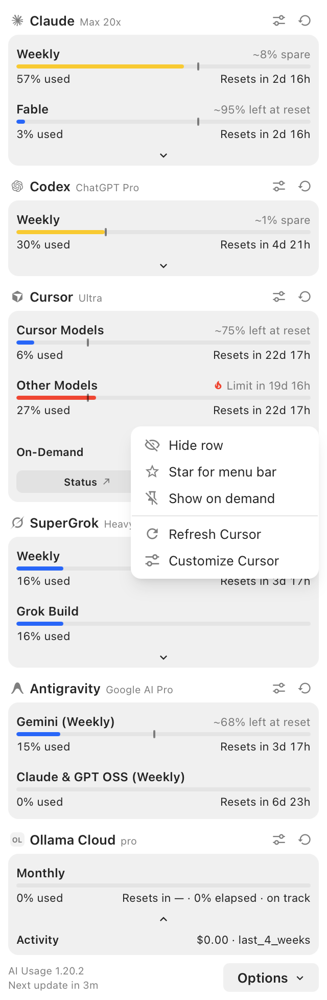
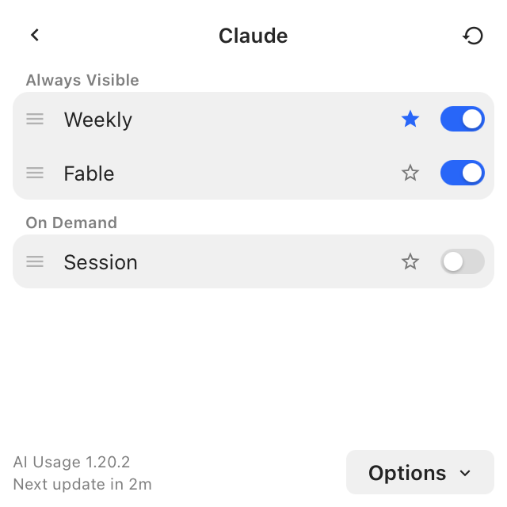
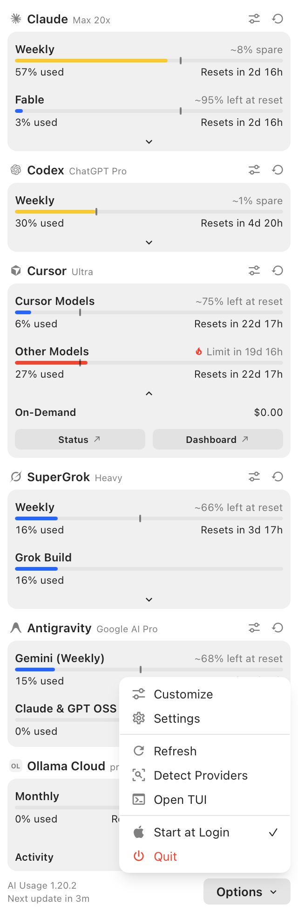
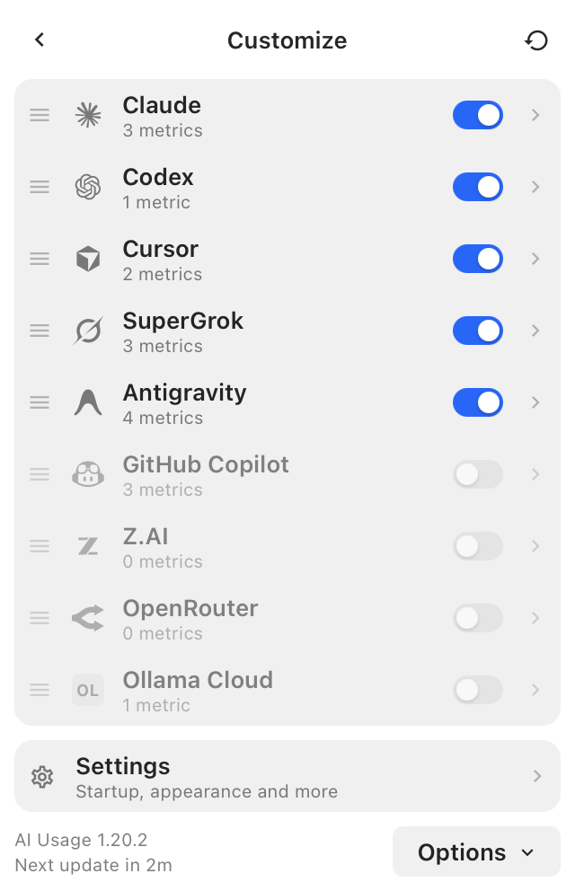
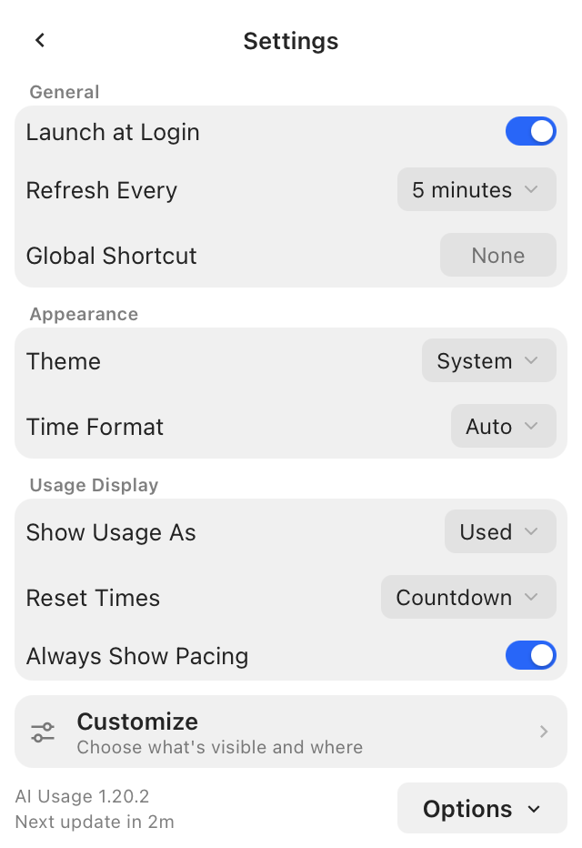

# AI Usage Bar — macOS menu bar app

The product UI is **`ai-usagebar-tray`**: an NSStatusItem plus a WKWebView
popover that shares its dashboard with the [Windows tray](../windows/README.md)
(OpenUsage layout: provider cards, capsule meters, Customize, Settings). The
menu-bar glyph is a compact **usage chart** of starred metrics (at most two
per provider).


```bash
cargo build --release --bin ai-usagebar-tray
./target/release/ai-usagebar-tray
```

Needs Node.js 20+ on PATH for the first build (`windows/popover/` Vite bundle).
Left-click the status item to toggle the popover; right-click for Refresh /
Detect / Open TUI / Start at Login / Quit. No Dock icon.


Star up to two metrics per provider from a row's right-click menu or from
Customize; those fills are what the status item paints.





The footer's Options menu reaches Customize and Settings, the same actions as
the status item's right-click menu, and Start at Login (a LaunchAgent under
`~/Library/LaunchAgents`).







A legacy Swift `NSMenu` (`ai-usagebar-menubar.swift`) remains in this folder
for the old dropdown. Prefer the tray.

> **Installing?** Follow the step-by-step in **[INSTALL.md](INSTALL.md)**.

## Vendor scope

The selector dynamically discovers **all providers** that ship in the binary via `ai-usagebar vendors --json`:

- **Rate-limit windows (session / weekly / monthly):** Claude, Codex,
  Z.AI (GLM), Google Antigravity (two independent pools — Gemini, and
  Claude & GPT OSS — each with its own 5h/weekly pair), MiniMax (chat and video
  pools, each with 5h/weekly tracking), GitHub Copilot (premium finite pool,
  with unlimited chat and completions reported cleanly), SuperGrok, Kiro,
  Nous Research, OpenCode Go (session, weekly, and monthly pools), Command Code
  (session, weekly, and monthly pools), and Grok Bot (weekly included-usage
  pool from the Grok Bot desktop app).
- **Included-usage pools:** Cursor (Cursor Models and Other Models, both reset
  on the billing cycle).
- **Balance-only:** OpenRouter, DeepSeek, Kimi, Kilo, Novita, Moonshot, Grok
  (xAI), and Anthropic API. These have no 5h/weekly quota windows, so the app
  shows their balance/credits in the header (`cr <amount>`) and suppresses the
  session/weekly rows. Anthropic API additionally renders a spend-vs-limit
  bar when a monthly limit is configured.

The app uses `ai-usagebar vendors --json` as its canonical metadata source so
vendor availability, authentication status, and CLI requirements always match the
backend without duplicated static tables. Only **enabled** vendors appear in the selector. The opt-in vendors default
to disabled in the Rust config, matching `src/config.rs`; set
`[vendor].enabled = true` (or save an API key via the TUI) to turn one on.

Antigravity has no credential file to check, so the Vendors pane treats it as
**configured** once it finds any of Antigravity 2.0/IDE/`agy`'s state
directories (`~/.gemini/{antigravity,antigravity-cli,antigravity-ide}`) — the
binary itself discovers whichever local server is actually reachable
(Antigravity 2.0, the IDE, or an interactive `agy` session) via `lsof` at fetch
time, so one of those must be running for quota to load.

## Requirements

- Rust (`rustc` 1.88+) and **Node.js 20+** (the tray embeds the Vite popover).
- Run `claude` once on the Mac so its OAuth creds are in the login **Keychain**;
  ai-usagebar reads them there automatically (no env vars).

## Build & run

```bash
cargo build --release --bin ai-usagebar-tray
./target/release/ai-usagebar-tray
```

Start at login from the popover **Settings → Launch at Login**, or the status
item's right-click menu. That writes
`~/Library/LaunchAgents/com.akitaonrails.ai-usagebar-tray.plist`.

The legacy Swift dropdown:

```bash
cd macos
./build.sh
./ai-usagebar-menubar &
```

> Not code-signed. It's a local binary you built yourself, so Gatekeeper
> doesn't block it when launched from the terminal / LaunchAgent. If macOS ever
> complains, right-click the binary in Finder → **Open** once.

## Configuration

Open **Preferences** from the dropdown (or press **⌘,**) — a native window
with toggles, color pickers, vendor, interval, bar width, and binary path.
Settings persist in `UserDefaults` and apply **live, no rebuild**.

| Setting | Default | Notes |
|---|---|---|
| Show 5h / weekly / extra | on / on / off | which bars appear |
| Show percentage/value | on | numeric value next to each bar |
| Show bars | on | off = numbers only |
| Show pace marker | on | persisted `showMeta`; draws the elapsed-time marker only when the window has reset and elapsed output |
| Show reset time instead of a countdown | off | persisted `showResetClock`; shows *when* a window resets as a wall-clock time — a date once the reset is past today — following the system's 12h/24h convention |
| Bar width | 8 | cells per menu-bar bar (4–20) |
| Colors (low/mid/high/critical/empty) | One Dark | bar color per severity (≥90 / ≥75 / ≥50 / else) |
| Refresh interval | 30 s | 5–3600 |
| Vendor | anthropic | selectors: only enabled vendors (see [Vendor scope](#vendor-scope)). Vendors expose rate-limit windows (session, weekly, monthly, or video pools); balance-only vendors show a credit balance instead. |
| Binary path | auto | empty = `~/.cargo/bin`, Homebrew, then `PATH` |
| Global vendor shortcut | on | **⌥⌘\\** cycles every configured vendor/account and Overview; turns itself back off if macOS cannot register it |
| Global compact shortcut | on | **⌥⌘E** toggles Overview between mini bars and compact text; turns itself back off if unavailable |
| Start at login | current LaunchAgent state | writes/removes the per-user LaunchAgent; write errors are shown below the toggle |

`[ui] overview_vendors = ["anthropic", "cursor", "openai"]` in
`config.toml` limits and orders the Overview on macOS exactly as it does in the
TUI. Requesting `anthropic` includes every configured named Claude account.

In Overview mode, each dropdown row is a **checkbox**: click it to drop that
provider from the always-visible top-bar summary (checkmark = shown; unchecked +
dimmed = hidden). Hidden providers stay listed so you can re-enable them, and the
choice persists. Jumping to a provider's detail view is via the *Switch provider*
submenu / ⌥⌘\ (the Overview row click toggles visibility instead).

The Preferences window needs **macOS 12+** (the menu bar itself works on
10.15+). Tags/labels use the system label colors, so they adapt to a light or
dark menu bar; only the bar fill/empty colors are configurable.

Pace markers require both a real reset and elapsed-time output. Claude, Codex,
Z.AI, MiniMax and Antigravity supply that pair; the remaining vendors render
their generic windows without a pace marker. When available, the fixed
blue `│` pace marker is placed at elapsed time. Fill past the marker follows the
point-delta colors used by the Rust widget: at
least 10 points ahead is critical/red, 1–9 ahead is high/orange, -10 through
on-pace is mid/yellow, and more than 10 under is low/green. Windows without a
reset (including a displayed `—`) retain their row but do not draw a marker.

## Indicator style

The "Indicator style" preference chooses between **block bars** (`░█`, the
default) and a **ring** (`○`) drawn with `NSBezierPath` (AppKit). The ring paints
the usage fraction as a severity-colored arc over a faint track, with the same
pace marker as the block bar: calm fill from 12 o'clock up to the lesser of the
current percentage and the elapsed tick; any fill past the tick is
warning-colored. Both the menu
bar and the dropdown rows honor the choice. The track adapts to the effective
appearance — faint white on dark menu bars (where the dark `COLOR_EMPTY` would
be invisible) and `COLOR_EMPTY` on light ones.

## Quick vendor switch

A **"Switch provider"** submenu in the dropdown (between "Refresh now" /
"Open TUI" and "Preferences…") lists only configured vendors, with a
checkmark on the active one.
Selecting one switches immediately, without opening Preferences.
The global **⌥⌘\\** shortcut performs the same cycle from any app; disable it
under Preferences → Shortcut if that chord belongs to another application.

## Multiple Claude accounts

Named Anthropic accounts from the binary's config
(`[[anthropic.accounts]]` entries and `[anthropic] accounts_dir`
auto-discovery — see the main README's "Multiple accounts") each get their own
entry, "Claude · label", in the vendor submenu, the ⌥⌘\ swap ring, the
Preferences selector, and the Overview. Each is fetched as
`--vendor anthropic --account <label>`, so caches and token refreshes stay
per-account. Set `[anthropic] show_default_account = false` to hide the
default (unnamed) Claude entry when every account is managed explicitly.
Every immediate `accounts_dir` subdirectory counts as an account; this includes
macOS logins whose credentials exist only in a config-dir-scoped Keychain item.

### Switching which account you are signed in as

Those entries decide whose usage is *shown*. Which account you are actually
signed in as is a separate thing — and there are two of them, the Claude
Desktop app and the `claude` CLI, which drift apart.

The dropdown gets a **Claude Desktop ▸** and a **Claude Code ▸** submenu, each
listing the accounts it knows with a checkmark on the active one. Pick another
to switch to it; pick **Adicionar conta…** to capture a new one (that part is
interactive, so it opens in Terminal). A dim line under the header shows both
active accounts at a glance — `Desktop: work · Code: personal`.

Switching the Desktop app **quits and reopens Claude.app**, so the menu confirms
first; your local history is merged into the target account and a rollback
archive is written before anything changes. The Claude Code switch has no
visible side effect and happens straight away. Both submenus grey out while a
switch is running.

The same thing from the shell:

```bash
ai-usagebar account status                  # who each surface is signed in as
ai-usagebar account add work --desktop      # capture a Claude Desktop account
ai-usagebar account switch work --dry-run   # what a switch would do
ai-usagebar account switch work --desktop   # quits and reopens Claude.app
```

See the main README's *Switching the active Claude account* for the full story.

## Multiple Codex accounts

Entries from `[[openai.accounts]]` appear as “Codex · label” in the provider
submenu, Preferences, Overview, and the vendor-cycle shortcut. Each is fetched
with `--vendor openai --account <label>`; Rust resolves its `codex_auth_path`
and keeps its cache separate. Named accounts do not require a default Codex
login. Disabling `[openai]` hides all its accounts.

Setting `[ui] overview_vendors = ["openai"]` includes all configured Codex
accounts. Each Overview checkbox still controls that account's visibility.
Selecting an entry changes whose usage is displayed, not the active Codex login.

## Multiple OpenRouter accounts

Entries from `[[openrouter.accounts]]` appear as separate menu choices and use
`--vendor openrouter --account <label>` behind the scenes. Each account keeps
its own cache. Set `[openrouter] show_default_account = false` when you do not
want the unnamed key listed. See the main
[OpenRouter account guide](../docs/openrouter-accounts.md) for configuration.

## Live config reload

The app watches `config.toml` and reloads on any change — enable a vendor, add
an account, tweak an `[ui]` knob, and the menu bar updates within a second, no
restart. It re-arms across an editor's atomic save, and a half-written file
mid-edit is ignored (the running config is kept until the file parses again).
The TUI does the same, polling the file every couple of seconds.

## How it works

Runs `ai-usagebar --vendor <v> --format '{plan};;{session_pct};;…'`, parses the
Waybar JSON (`{text, …}`), and draws the bars as colored `NSAttributedString`s
in the status item and the dropdown. The subprocess runs **off the main thread**
(`DispatchQueue.global` → back to `.main` for UI), so the UI never blocks.

### Enable a connected provider

Preferences → Vendors shows **Disabled** even when a credential is available.
Click **Enable** to include the provider in usage reporting; if it still needs
a credential, the row then offers its usual sign-in or configuration action.
Enabling does not sign in, switch accounts, or change the selected provider.
The menu reloads the configuration automatically.

This requires a binary supporting `ai-usagebar settings enable <vendor>`.
If enabling fails, Preferences shows an error and keeps the provider state
from the catalog. Update the binary if it does not recognize the command.
