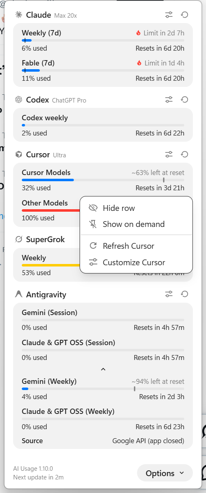
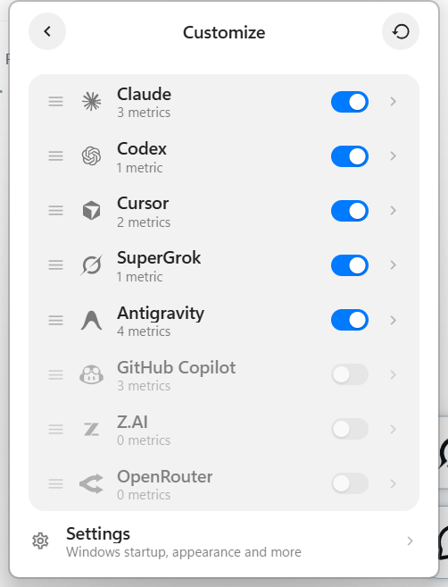
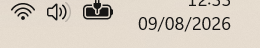

# AI Usage Bar — Windows tray popover

A NotifyIcon + WebView2 popover for [`ai-usagebar`](../README.md). Left-click
the tray icon for a dashboard that follows the OpenUsage (SwiftUI edition)
design: a 320 px panel that sizes itself to its content, provider sections
with capsule meters, reset countdowns and spend rows. It is the Windows
counterpart to the
[KDE plasmoid](../kde-plasmoid/README.md): same `usage --json` report, same
severity colors, no console window.

The host is `ai-usagebar-tray.exe` (Rust, in-process fetch). The UI is a
Vite + React + shadcn app in `windows/popover/` (Iconify icons via
`unplugin-icons`). The view-model in `src/model.js` has a Node contract
test that does not need `npm install`.


## Requirements

- Windows 10 (recent) or Windows 11, with the **WebView2 Evergreen** runtime
  (preinstalled on Windows 11).
- A Rust toolchain (`rustc` 1.88+).
- **Node.js 20+** on PATH — `cargo build --bin ai-usagebar-tray` runs
  `npm ci` / `npm run build` in `windows/popover/` (Vite emits
  `dist/popover.js` + `dist/popover.css`, which the host `include_str!`s).
- At least one provider enabled in `%APPDATA%\ai-usagebar\config\config.toml`.

## Build & run

```powershell
cargo build --release --bin ai-usagebar-tray
.\target\release\ai-usagebar-tray.exe
```

The process has no console. If a second instance is started, it exits
immediately. Pin the icon in the Windows 11 notification overflow so it stays
visible.

## Gestures

| Action | Result |
|---|---|
| Left-click | Toggle the popover |
| Right-click | Refresh, Detect Providers, Open TUI, Start with Windows, Quit |
| Footer Options ▾ | Customize, Settings, Refresh, Detect Providers, Open TUI, Start with Windows, Quit |
| Footer “Next update in …” | Refresh now |
| Click `52% left` under a bar | Flip Used ⟷ Left everywhere (hover shows the other reading) |
| Click `Resets in …` | Flip countdown ⟷ exact time everywhere |
| Options → Customize (or Return) | Provider list: toggle, drag the grip to reorder, open a provider |
| Provider Customize | Always Visible vs On Demand rows (toggle + drag across the divider); Reset in the top bar |
| Options → Settings | Launch at Login, Refresh Every (1/5/10 min), Global Shortcut, Theme, Density (Default/Compact), Time Format, Show Usage As, Reset Times, Always Show Pacing, Updates |
| Provider header icons (right) | Customize that provider's rows, or reset them to the defaults |
| Right-click a row | Hide row · Always show / Show on demand · Refresh provider · Customize provider |
| Drag a provider header | Reorder provider sections |
| Caret inside the card | Show or hide On Demand rows |
| Global shortcut | Toggle the popover from anywhere (set in Settings → Global Shortcut) |
| Escape / Back | Back one screen |
| Escape (dashboard) | Close the popover |





## Pace

A bounded row with a known window projects the current burn rate to the end
of the window (ported from OpenUsage's Pace) and shows it two ways. A thin
**tick** on the meter marks the even-pace line: where the fill would sit if
usage burned evenly across the window (it mirrors with the Used/Left
toggle). A **note** on the row's first line, right of the label, reads
🔥 "Limit in 1h 53m" (or "Limit today at 11:49 PM" in exact mode) when the
quota runs out before the reset, "~3% spare" when the projection lands in the
last 10 %, and "~40% left at reset" when there is room. Red and orange rows
always show both; blue rows show them only with **Settings → Always Show
Pacing**. Rows with no window, nothing spent yet, or less than 1 % of the
window elapsed show neither. The meter's colour is still the provider's
severity, not the pace verdict.

## Time format

Exact reset times ("Resets today at 6:38 PM") follow the Windows locale by
default. **Settings → Time Format** pins them to 12-hour or 24-hour clocks
regardless of the system setting.

## Updates

The tray checks GitHub Releases of the repository named in `Cargo.toml`'s
`repository` field (`CARGO_PKG_REPOSITORY` at build time) for a newer build, so
a fork that builds its own tray updates from its own releases. **Settings → Updates**
picks the mode: **Automatic** downloads and installs a release as soon as it
is found, **Notify** only shows a banner at the top of the dashboard with an
"Install Update" button (✕ snoozes it; a blue dot next to the version in the
footer remembers it is waiting), and **Off** stops the hourly background
check. **Check Now** runs a check on demand in every mode and the line under
it says when the last one ran. Once a release is known the same button reads
**Update** and installs it. The mode is the `updates` key of the `[tray]`
section in `config.toml`, next to the shortcut and the poll interval.


The download is verified against the release's `.sha256` sidecar, which
proves the file arrived intact — integrity, not authenticity: anyone who can
publish a release can publish a matching sidecar. Installing swaps the
running executable for the new one and leaves the previous build as
`ai-usagebar-tray.exe.old`, which the next start removes. Debug builds
(`cargo build` without `--release`) check but refuse to install. The release
assets it looks for (`ai-usagebar-<bin>-windows-x86_64.exe` + `.sha256`) are
produced by the Windows job in `.github/workflows/release.yml`, so the first
release cut after this change is the first one the tray can install.

## When the popover closes

The popover is transient: it hides when you click outside it, click the tray
icon, press the global shortcut again, or press Escape on the dashboard. It
does **not** hide when focus merely moves inside its own process, nor when the
taskbar activates itself with no mouse button down (Windows does that
occasionally on a tray refresh). Vendors that shell out for their data (the
Grok Build ACP, `gh auth token` for Copilot) run their child without a console
window; before that fix each refresh flashed a console that took the
foreground and closed the popover.

To see why it closed, start the tray with `AIUB_TRAY_TRACE=1`: every blur,
report and hide is appended to `%TEMP%i-usagebar-tray-trace.log` with the
window that held the foreground.

## Errors and warnings

A provider whose refresh failed but still has a cached snapshot keeps its
numbers and shows an orange ⚠ in its header plus a one-line note at the
bottom of the card; hovering either shows the raw diagnosis. Antigravity
only reports "isn't running" when there is no local server *and* no saved
Google session to fall back on: with the app closed but signed in, the card
shows the quota from Google's API with a "Source · Google API (app closed)"
row. A
provider with nothing to show gets a red ⚠ and a card with the verdict, a
hint, and — when the fix is something the tray can do — a button (Open TUI
for a missing key, Refresh for a network or server error). Sign-in problems
name the terminal command instead, and a rate-limited vendor says when it
will retry.

## First launch and provider detection

Before its first report, the tray runs the same local credential detection
OpenUsage does on a fresh install: for every vendor it has not seen before it
checks — on this machine only, never over the network — whether a credential
already exists, and writes `enabled = true` into `config.toml` for the ones
that do. It never turns a vendor off, and it never re-checks a vendor it has
already seen (`%LOCALAPPDATA%ai-usagebardetect.json` remembers them), so
your own `enabled` choices always win. **Options → Detect Providers** re-runs
the check for every vendor on demand, for example after signing in to a new
tool. The same detection is available everywhere as `ai-usagebar detect`
(`--all` to re-check, `--json` for scripts).

After an HTTP 429 the shared cache backs off for five minutes: the card keeps
its last good numbers, or reads "Retrying automatically in 4m" when there are
none, and neither the poll nor a manual Refresh hits that vendor meanwhile.

What each probe looks at: Claude `~/.claude/.credentials.json`; Codex
`~/.codex/auth.json`; Cursor `state.vscdb` or `cursor-agent` `auth.json`;
Kiro `data.sqlite3`; Kimi `~/.kimi-code/credentials`; SuperGrok
`~/.grok/auth.json`; Command Code `~/.commandcode/auth.json`; GitHub Copilot
`GITHUB_COPILOT_TOKEN` or the `gh` CLI `hosts.yml`; Antigravity a running
local product; Nous Research the saved OAuth credential; and every API-key
vendor (Z.AI, OpenRouter, DeepSeek, Grok, Kilo, Novita, Moonshot, MiniMax,
OpenCode Go, Anthropic API) its env var or the `api_key` in `config.toml`.

The first report with data then seeds the popover layout the way OpenUsage
does: providers whose only problem is a missing API key start hidden, and a
welcome card at the top of the dashboard points to **Options → Customize**,
where any provider can be turned back on. That seeding runs once per WebView
profile; afterwards the Customize switches are the only thing that hides a
provider. Hiding is popover-local — to stop fetching a vendor everywhere (TUI,
widget, tray) set `enabled = false` for it in `config.toml` or use the TUI
Settings.

Open TUI launches `ai-usagebar-tui` in Windows Terminal (`wt.exe -e …`) when
present, otherwise `conhost.exe`. Provider keys stay in the TUI (`s`).
Provider order, hidden providers, Always Visible / On Demand rows, theme,
density, “show usage as” and reset-time format are remembered in the popover.
Provider marks live in `windows/popover/src/icons/providers/` (OpenUsage, MIT;
simple-icons, CC0) and load through an `unplugin-icons` custom collection;
a provider without a mark shows its initials — including `[[custom]]`
providers from `config.toml` (see the root README, "Custom providers").

The tray re-reads every provider every 5 minutes by default (**Settings →
Refresh Every**: 1, 5 or 10; `[tray] refresh_minutes`). The cache TTL stays
60 s, so the footer's Refresh is always allowed to fetch. A stale or failed vendor is
shown on its card. The global shortcut, the poll interval and the update mode
are the keys of the `[tray]` section in `config.toml`; the popover's Settings
screen writes them. The NotifyIcon is a bar-chart-in-circle mark, three bars inside a ring
(source in `windows/tray-icon.svg`), shipped as anti-aliased rasters
at 16/20/24/32/40/48 px so the shell gets the exact size for the current DPI.
It has no hover tip; the popover is the readout.



## Tray icon rasters

`src/tray/icon.rs` embeds `windows/tray-icon-{16,20,24,32,40,48}.rgba`
(raw RGBA, black ink, alpha carries the anti-aliasing) and hands the shell the
size `SM_CXSMICON` asks for, so Windows never resamples the glyph. To change
the icon:

1. Overwrite `windows/tray-icon.svg` (24-unit grid, `currentColor` strokes or
   fills, like an Iconify export).
2. Run `node windows/icon/rasterize.js` and open the URL it prints in any
   Chromium or Firefox. `windows/icon/render.html` renders the SVG on a canvas
   at every size, crops one unit off each edge so the mark fills the icon,
   scales strokes per size (`strokeScale` in the page: 1× up to 24 px, 0.9×
   above, tuned for a 2-unit stroke; raise it for a thinner source SVG),
   shows a 3× preview on light and dark, and posts the PNGs back.
3. The script decodes the PNGs itself (no npm packages), forces RGB to black,
   writes the `.rgba` files plus `windows/tray-icon.png` (32 px preview) and
   exits.
4. `cargo test --lib tray::icon` checks every raster is square, black,
   anti-aliased and transparent at the corners; then rebuild the tray.

PNG bytes never go through a terminal or a chat window on purpose: hand-copied
base64 corrupted the rasters twice before this tool existed.

If the popover does not open on Windows 10, install the
[WebView2 Evergreen Runtime](https://developer.microsoft.com/microsoft-edge/webview2).
The tray icon tooltip names that runtime when WebView2 is missing; the
right-click menu still works.

## Tests

```powershell
node windows/popover/popover.test.mjs
cargo test --lib tray
```

Linux CI runs the Node test via `make desktop-test`. The Windows CI job
also compiles the host with `cargo clippy --all-targets` and
`cargo test --all-targets`.
